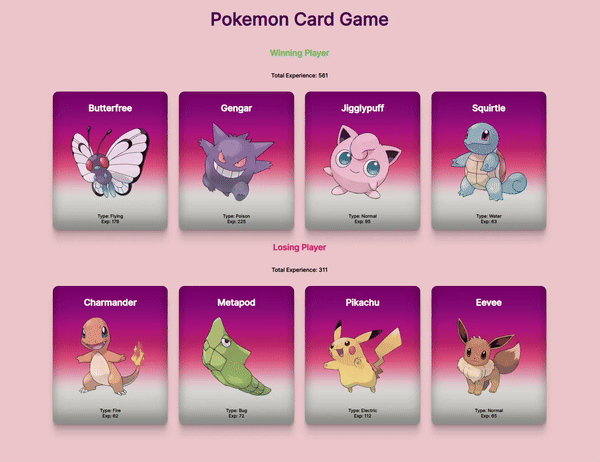

<h1>Pokedex Card Game</h1>

Bu proje React ile hazırladığım basit bir Pokemon kart oyunudur. Projede,rastgele seçilen Pokemon kartları arasında bir mücadele deneyimi yaşanır ve kartlar arasındaki toplam deneyim puanına göre bir kazanan belirlenir.

<h2> Kullanılan Teknolojiler </h2>

<ul>
<li>React</li>
<li>JavaScript</li>
<li>HTML</li>
<li>CSS</li>
<li>PokéAPI: Pokemon bilgilerini çekmek için kullanılan API</li>
</ul>

<h2> API Kullanımı </h2>
Projede Pokemon bilgilerini çekmek için PokéAPI kullanılmaktadır. API, Pokemon türleri, yetenekleri, görüntüleri ve daha fazlası gibi çeşitli bilgileri sağlamaktadır. Bu bilgiler oyun içinde Pokemon kartları oluşturmak için kullanılmaktadır.

<h2> Proje Amacı/h2>
 Proje React yapısı, API kullanımı ve geliştirme süreci hakkında genel bilgiler içermektedir. Projeyi daha da geliştirmek veya özelleştirmek için gerekli olduğunu düşündüğünüz ek bilgileri ekleyebilirsiniz.

<h2>Ekran Görüntüsü</h2>

